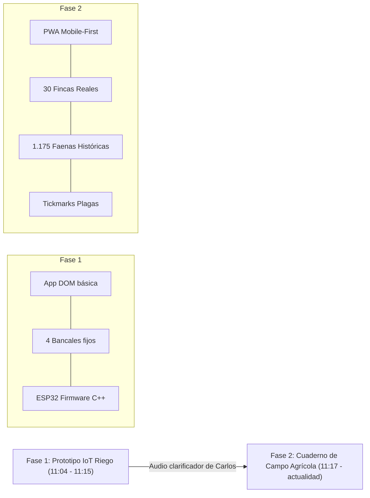

# 02. Requerimientos Funcionales y Decisiones Técnicas

Este documento consolida los requerimientos de negocio y de campo solicitados por **Carlos** y **Jordi**, así como las decisiones técnicas y de arquitectura tomadas durante el desarrollo en Orca.

---

## 🎯 Requerimientos Funcionales (Visión del Negocio)

### 1. Acceso y Perfiles de Usuario
- **Equipo Operativo:** 3 usuarios principales identificados:
  - 👨‍🌾 **Carlos (C)**
  - 🚜 **Juan Carlos (JC)**
  - 🌱 **Diego (D)**
  *(Colaboradores ocasionales detectados en registros históricos: Juan, Jorge, Flor).*
- **Acceso Mobile-First sin fricción:** Entrada rápida tocando el nombre del operario sin requerir contraseñas largas ni registros complejos durante la fase inicial de validación.

### 2. Cuaderno de Campo y Partes de Faena Rápida (`✍️ Registrar Faena`)
Diseñado para registrar actuaciones en campo o desde el vehículo en menos de 1 minuto:
- **Selector de Finca:** Desplegable o buscador de las 30 fincas registradas.
- **Autor y Fecha:** Selección del operario responsable y fecha automática (por defecto hoy).
- **Categoría de Faena:** Tratamiento fitosanitario, Riego / Fertirriego, Poda / Deschuponado, Desbroce / Triturado, Recolección o Revisión visual.
- **Tratamientos y Químicos:** Registro de productos (ej. Abamectina, Cobre, Clorpirifos/Spintor, T1, T2, T22...) y dosis de cuba.
- **Tickmarks Rápidos de Plagas (Requisito clave de Carlos):** Casillas táctiles de activación inmediata:
  - 🦟 Trip
  - 🪰 Mosca blanca
  - 🕷️ Araña roja
  - 🐞 Cotonet (*Delottococcus aberiae*)
  - 🦠 Piojo rojo de California
  - 🐛 Minador de los cítricos
- **Estado de la Hierba:** Botones visuales de 3 estados:
  - 🟢 Sin hierba / Limpio
  - 🟡 Poca hierba
  - 🔴 Mucha hierba (marcar para desbroce)
- **Informe de Estado de los Árboles:** Campo de texto libre para observaciones agronómicas (vigor, brotación, floración, amarilleo, etc.).

### 3. Fichas Técnicas Baseline de Fincas (`🍊 Mis Huertos`)
Fichas maestras para cada una de las 30 parcelas con datos agronómicos estructurales:
- **Nombre de la finca** (ej. *Montanyeta, Oliveres, Armetler, Kakis...*).
- **Cultivo principal** (*Cítrics, Olivar, Armetlers, Kakis, Garroferes...*).
- **Variedad** (*Clemenalba, Clemenules, Navel, Lane Late...*).
- **Patrón / Portainjerto** (*Citrumelo, Carrizo, Macrophylla...*).
- **Marco de plantación** (*6x4, 5x5...*).
- **Superficie:** Hanegadas valencianas y Hectáreas.
- **Identificador Catastral / SIGPAC** (ej. `12-135-0-0-30-368-1`).
- **Subparcelas o Bancas** (ej. *Banca gran 1, Banca gran 2, Plantona 1...*).

### 4. Doble Modalidad de Consulta
- **Vista por Parcela (`🍊 Mis Huertos`):** Al pulsar sobre cualquier huerto, se despliega la ficha completa y el histórico cronológico de todos los tratamientos y labores efectuados en él.
- **Muro Global de Faenas (`📢 Muro de Faenas`):** Feed cronológico inverso con las últimas actuaciones realizadas por cualquier miembro del equipo, con filtros rápidos por huerto y operario.

---

## 🏗️ Evolución de la Arquitectura del Proyecto

El desarrollo ha transitado por dos fases claramente diferenciadas:

### Fase 1: Prototipo Inicial de Riego IoT (11:04 - 11:15)
- **Enfoque inicial:** A raíz de la petición genérica *"una web para un amigo que quiere controlar el huerto"*, se planteó una solución domótica típica:
  - Dashboard para 4 sectores fijos (Bancal A, Bancal B, Sector C, Sector D).
  - Temporizadores de electroválvulas (2 min, 5 min, 10 min) y parada de emergencia.
  - Nivel de depósito de agua y telemetría de humedad con Chart.js.
  - Firmware base para ESP32 en [`hardware/esp32_huerto_carlos.ino`](file:///C:/Users/Jordi/orca/web-huertos-carlos/hardware/esp32_huerto_carlos.ino).

### Fase 2: Cuaderno de Campo Agrícola Multi-Huerto (11:17 - Actualidad)
- **Cambio de paradigma:** El audio de Carlos aclaró que se trataba de una **explotación citrícola profesional** con múltiples parcelas distribuidas geográficamente.
- **Reorientación de la interfaz:** La aplicación se reconvirtió en un cuaderno de explotación agrícola digital enfocado a la movilidad y rapidez de reporte en campo.
- **Carga de datos masivos:** Se integró el archivo Excel oficial de Carlos (`tools/huertos_carlos.xlsx`), volcando 30 hojas completas a JavaScript mediante un script Python.

---

## 🛠️ Decisiones Técnicas y de Diseño

1. **PWA Vanilla (HTML5 + CSS3 + ES6 Modules / Scripts):**
   - Se descartaron frameworks pesados (React, Angular, Vue) para garantizar tiempos de carga inferiores a 200 ms en conexiones móviles 3G/4G rurales.
   - PWA con `manifest.json` y `sw.js` para instalación en pantalla de inicio de Android e iOS.
2. **Modelo de Datos en Cliente (`datos_huertos.js` + `localStorage`):**
   - La base de datos histórica inicial (1.175 faenas) se compila en un archivo estático JS (`datos_huertos.js`), lo que permite visualización instantánea sin base de datos remota ni latencia.
   - Las nuevas faenas registradas en el móvil se guardan en el `localStorage` del navegador y se unifican en memoria.
3. **Despliegue Serverless en GitHub Pages:**
   - Despliegue automático mediante GitHub Actions (`.github/workflows/pages.yml`), accesible públicamente vía HTTPS sin costes de servidor ni mantenimiento.
